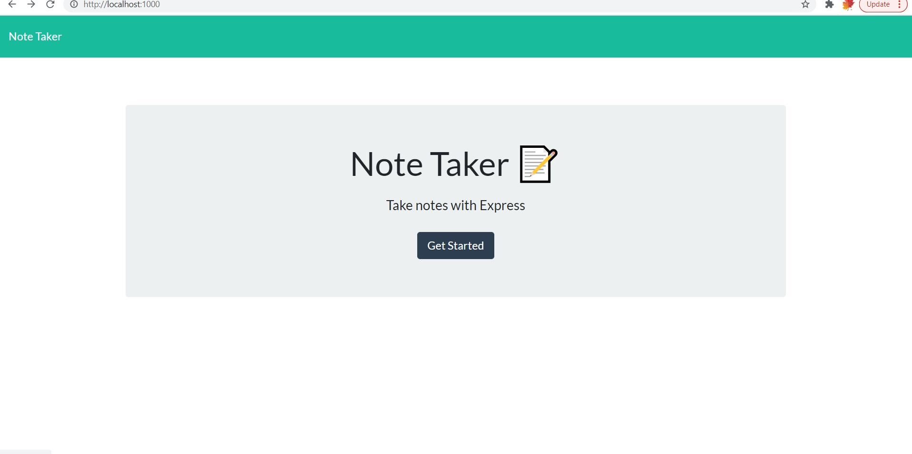
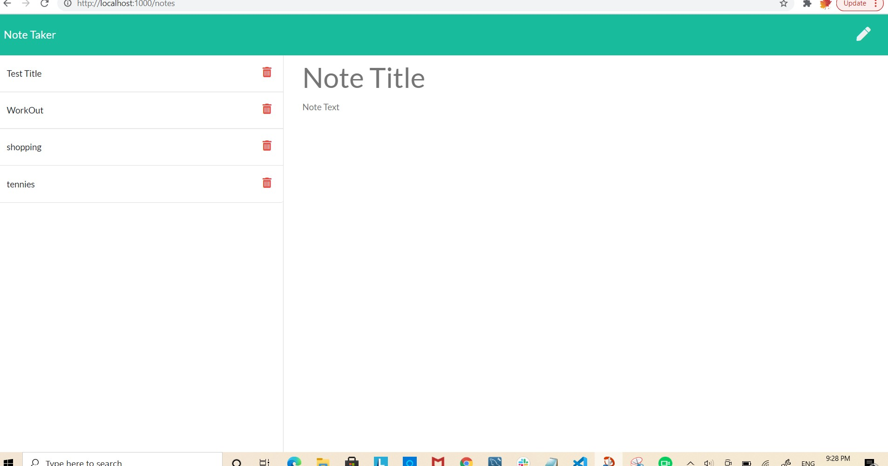

## NOTE_TAKER

<!-- TABLE OF CONTENTS -->
<details open="open">
  <summary>Table of Contents</summary>
  <ul>
    <li>
      <ul>
        <li><a href="#User Story">User Story</a></li>
        <li><a href="#Acceptance Criteria">Acceptance Criteria</a></li>
          <li><a href="#Built With">Built With</a></li>
          <li><a href="#Deployed Links">Deployed Links</a></li>
         <li><a href="#Screenshot">Screenshot</a></li>
        <li><a href="#Contact">Contact</a></li>
      </ul>
    </li>
    </ul>
</details>


## User Story
```
AS A small business owner
I WANT to be able to write and save notes
SO THAT I can organize my thoughts and keep track of tasks I need to complete
```

## Acceptance Criteria
```
GIVEN a note-taking application
WHEN I open the Note Taker
THEN I am presented with a landing page with a link to a notes page
WHEN I click on the link to the notes page
THEN I am presented with a page with existing notes listed in the left-hand column, plus empty fields to enter a new note title and the note’s text in the right-hand column
WHEN I enter a new note title and the note’s text
THEN a Save icon appears in the navigation at the top of the page
WHEN I click on the Save icon
THEN the new note I have entered is saved and appears in the left-hand column with the other existing notes
WHEN I click on an existing note in the list in the left-hand column
THEN that note appears in the right-hand column
WHEN I click on the Write icon in the navigation at the top of the page
THEN I am presented with empty fields to enter a new note title and the note’s text in the right-hand column
```


### Built With

*  JavaScript
*  Express.js
*  Bootstrap
*  HTML
* CSS
 
## Deployed Links
[Heruko link](https://ancient-waters-55405.herokuapp.com/)

[GitHub-link](https://github.com/shaimajobran/Note-Taker)


## screenshot




## Contact
If you have any questions about the repo, contact me at [shaimajobran](https://github.com/shaimajobran).